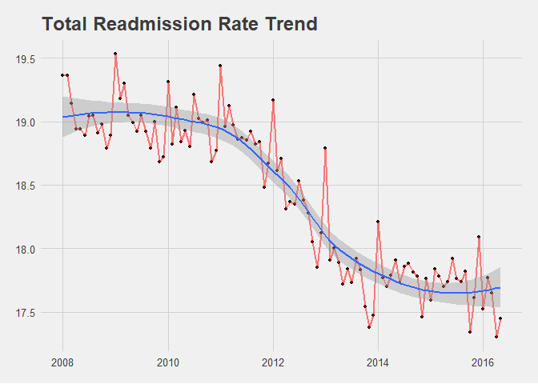
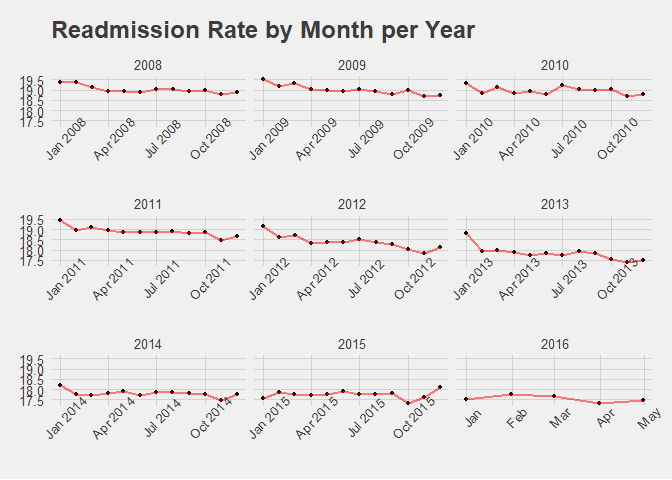
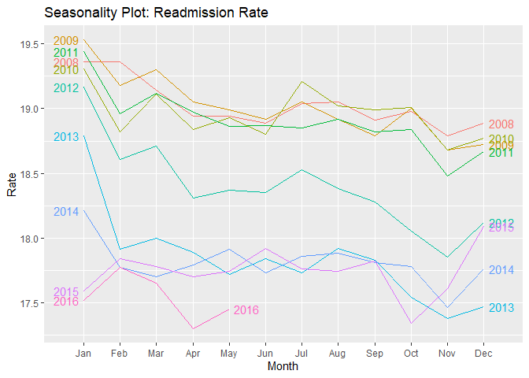
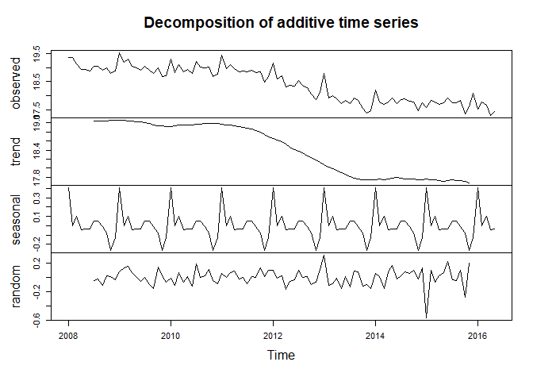
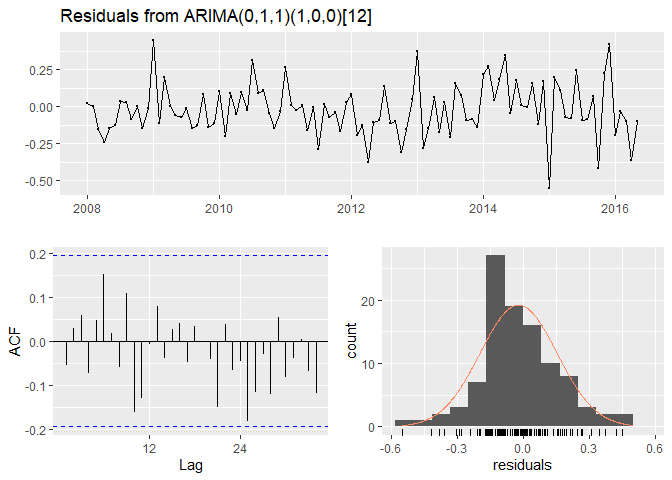
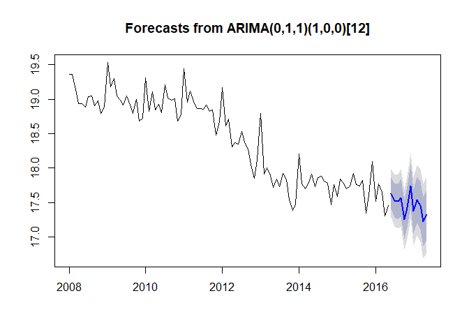

## CMS 30 Day Readmission Prediction


The hospital readmission rate PUF presents nation-wide information about inpatient hospital stays that occurred within 30 days of a previous inpatient hospital stay (readmissions) for Medicare fee-for-service beneficiaries. Readmissions rates are unadjusted for age, health status or other factors.


```
## `geom_smooth()` using method = 'loess' and formula 'y ~ x'
```

<!-- -->

## Readmission Rate by Year


<!-- -->

# Time Series Decomposition and Seasonality


While somewhat obscured by the overall downward trend, readmission rates do have some seasonality (more clearly shown in the decomposition below). Accross all years, radmission rates appear to increase towards yearend and decrease throughout the year, with moderate increases seen in July. <br>

- Yearend increases may be explained through patient tendnecies to hold off on elective procedures until deductables are met (although elective procedures are not counted against readmission rates, I need to verify if elective procedures that result in readmission would be counted) <br>

- Seasonal influenza <br>

- Increases in summer might be the result of increases in heat related illnesses. I'll see if I can dig up some additional CMS data which may shed light on these questions. <br>

<!-- -->

An additive time series decomposition is used as the seasonal variation is constanst (not increasing in magnitude for subsequent seasons).

<!-- -->


## ARIMA Model

While I'm using an autoARIMA model which evaluates different ARIMA model types for best performance, I've included a residual check showing the autocorrelation function (ACF) within threshold limits. Ljung-Box p-value suggests independent autocorrelation variables (values are not dependent on eachother). 


<!-- -->

```
## 
## 	Ljung-Box test
## 
## data:  Residuals from ARIMA(0,1,1)(1,0,0)[12]
## Q* = 12.743, df = 18, p-value = 0.8066
## 
## Model df: 2.   Total lags used: 20
```


```
## 
## 	Box-Ljung test
## 
## data:  res
## X-squared = 10.87, df = 12, p-value = 0.54
```


<!-- -->


```
## Series: ts 
## ARIMA(0,1,1)(1,0,0)[12] 
## 
## Coefficients:
##           ma1    sar1
##       -0.6209  0.6541
## s.e.   0.0737  0.0735
## 
## sigma^2 estimated as 0.03172:  log likelihood=28.08
## AIC=-50.15   AICc=-49.9   BIC=-42.34
## 
## Training set error measures:
##                       ME      RMSE       MAE        MPE      MAPE      MASE
## Training set -0.02268161 0.1754289 0.1353304 -0.1288239 0.7403277 0.5250396
##                     ACF1
## Training set -0.05545848
```


# Data Source

https://www.kaggle.com/cms/cms-ffs-30-day-medicare-readmission-rate

*The primary data source for these data is the CMS Chronic Condition Data Warehouse (CCW), a database with 100% of Medicare enrollment and fee-for-service claims data. For complete information regarding data in the CCW, visit http://ccwdata.org/index.php. Study Population: Medicare fee-for-service beneficiaries with inpatient hospital stays.*
